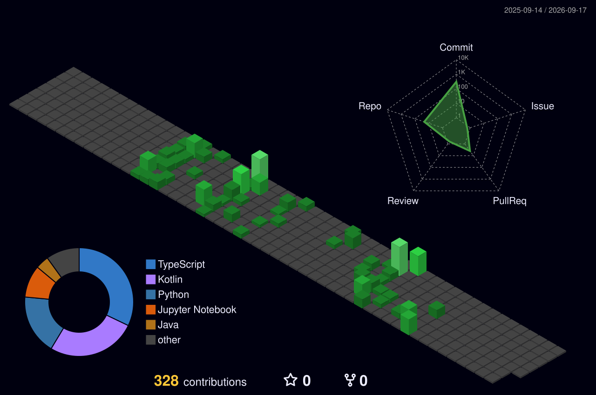

<div align="center">


<a href="https://github.com/AlBaraa63">
  
</a>

<br/><br/>

[](https://albaraaalolabi.dev)
[](https://github.com/AlBaraa63?tab=followers)
[](https://github.com/AlBaraa63?tab=repositories)


</div>

<br/>

## `$ whoami`


```text
> AI researcher & developer working at the
  intersection of perception and autonomy:
  models that detect, reason, and take
  action without hand-holding.

> Now      : IT Intern @ Abu Dhabi Social
             Support Authority
> Focus    : on-device mobile AI
             Model Context Protocol servers
             multi-step agentic workflows
> Published: IEEE SNAMS 2025
> Done     : 42 Abu Dhabi Piscine (passed)
             TomatoCare — Capstone II (Grade A)
> Certs    : CS50x · CS50P · CS50AI
```

<br clear="right"/>

## `$ ls featured-projects/`

| Project | What it does | Stack |
|---------|-------------|-------|
| 🍅 [**TomatoCare**](https://github.com/AlBaraa63/TomatoCare) | Fully offline bilingual Android app diagnosing 11 tomato diseases on-device. **97.59% lab accuracy, 12–20 ms inference, zero network calls.** | TFLite · MobileNetV3 · Kotlin/Compose · CameraX |
| 🏙️ [**CleanCity Agent**](https://github.com/AlBaraa63/Clean-City) | Turns trash photos into autonomous cleanup campaigns. MCP 1st Birthday Hackathon submission. | YOLOv8 · MCP · Gemini Vision · Gradio |
| 🛰️ [**Mission Control MCP**](https://github.com/AlBaraa63/Mission-Control-MCP) | Enterprise MCP server — RAG search, email classification, KPI generation, PDF processing, data viz. **8 tools.** | Python · FAISS · MCP |

<div align="right"><a href="https://albaraaalolabi.dev">→ full project catalog</a></div>

## `$ cat stack.txt`

<div align="center">

<a href="https://skillicons.dev">
  
</a>

<br/><br/>


</div>

## `$ git stats`

<div align="center">




</div>

## `$ fortune | cowsay`

<div align="center">


</div>

---

<div align="center">

<sub>IT Intern · Abu Dhabi Social Support Authority &nbsp;|&nbsp; <a href="https://github.com/AlBaraa63/42-Piscine">42 Abu Dhabi Piscine</a> &nbsp;|&nbsp; ex-CV Intern · Cellula Technologies &nbsp;|&nbsp; IEEE SNAMS 2025</sub>


</div>
